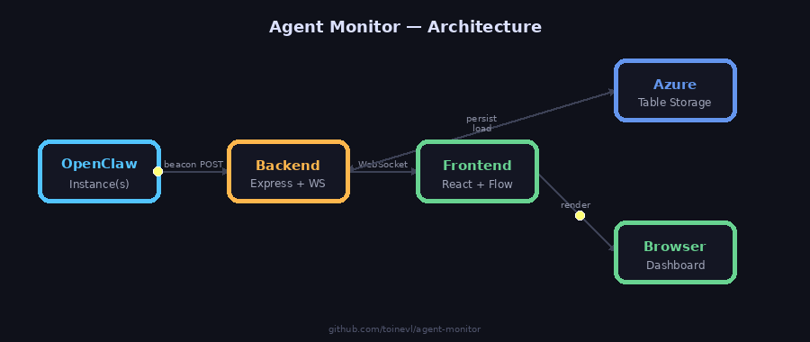

# Agent Monitor

> Real-time dashboard for monitoring OpenClaw multi-agent orchestration — sessions graph, fleet overview, and AI briefing reports.

[](https://agent-monitor.bluecliff-bb323f5a.northeurope.azurecontainerapps.io)
[](https://reactflow.dev)
[](https://nodejs.org)
[](https://azure.microsoft.com/en-us/products/container-apps)

---

## Overview

Agent Monitor gives you a live window into your OpenClaw deployment:

| Tab | What it shows |
|-----|---------------|
| **Sessions** | Real-time graph of active agent sessions and their relationships |
| **Instances** | Fleet overview — every OpenClaw instance beaconing in, with status, version, model, and uptime |
| **Reports** | Latest AI briefing report from your pipeline |

Updates are push-based over WebSocket — no polling, no inbound connectivity required from the agents.

---

## Architecture



```
┌─────────────────────────────────┐
│  OpenClaw Instance A            │
│  (beacon skill → POST /api/beacon) ──────────┐
└─────────────────────────────────┘            │
                                               ▼
┌─────────────────────────────────┐    ┌──────────────────┐    ┌───────────┐
│  OpenClaw Instance B            │───▶│  Agent Monitor   │◀──▶│  Browser  │
│  (beacon skill → POST /api/beacon) │    │  Backend         │    │  (React)  │
└─────────────────────────────────┘    │  Express + WS    │    └───────────┘
                                       └──────────────────┘
┌─────────────────────────────────┐            ▲
│  Local Pusher (sessions graph)  │────────────┘
│  (POST /api/push)               │  POST /api/push
└─────────────────────────────────┘
```

- **Instances** are reported by the `agent-monitor-beacon` skill installed on each OpenClaw instance
- **Sessions** are pushed by the local pusher process running alongside OpenClaw
- The backend broadcasts all state updates over WebSocket to connected browsers

---

## Quick Start

### Prerequisites

- Node.js 22+
- pnpm (`npm install -g pnpm`)

### Run locally

```bash
# 1. Frontend
pnpm install
pnpm run dev          # http://localhost:5173

# 2. Backend (separate terminal)
cd backend
npm install
node server.js        # http://localhost:3001
```

The frontend auto-connects to the backend at `localhost:3001`.

---

## Sessions Tab

Displays a live graph of OpenClaw agent sessions using [React Flow](https://reactflow.dev).

### How it works

A local pusher process collects session state from OpenClaw and POSTs it to `/api/push`. The backend broadcasts the update over WebSocket to all connected browsers, which re-render the graph in real time.

### Payload format (`POST /api/push`)

```json
{
  "agents": [
    { "id": "session-abc", "label": "Clippy", "status": "active" }
  ],
  "edges": [
    { "source": "session-abc", "target": "session-xyz" }
  ],
  "pushedAt": 1711620000000
}
```

Auth: `Authorization: Bearer <PUSH_SECRET>`

---

## Instances Tab

Fleet overview of all registered OpenClaw instances. Each instance beacons in periodically and is shown as a card with:

- 🟢 / 🔴 Online / offline status
- Version, model, channel
- Active sessions count
- Plugin counts
- Uptime
- Last seen timestamp

Instances are marked **offline** if no beacon is received within `OFFLINE_THRESHOLD_MS` (default: 10 minutes).

### Deploying the beacon skill

Each OpenClaw instance you want to track needs the `agent-monitor-beacon` skill installed.

**One-line install:**

```bash
curl -fsSL https://raw.githubusercontent.com/toinevl/agent-monitor/main/skills/agent-monitor-beacon/deploy-beacon.sh \
  | bash -s -- \
    --instance-id <your-instance-id> \
    --label "Your Instance Name" \
    --url https://your-agent-monitor-url.com \
    --secret your-beacon-secret \
    --all
```

`--all` is shorthand for `--heartbeat --cron --fix-heartbeat --send-now`. It:
- Adds the beacon task to `HEARTBEAT.md`
- Creates a cron job (every 15 min) so the instance stays online even if heartbeats are delayed
- Fixes heartbeat routing to the correct agent
- Sends an immediate test beacon

Run without flags for interactive mode (prompts for all values).

See [`skills/agent-monitor-beacon/deploy-beacon.sh`](skills/agent-monitor-beacon/deploy-beacon.sh) for the full install script.

**Manual install:**

1. Copy `skills/agent-monitor-beacon/` to the `skills/` folder of the OpenClaw instance
2. Create `skills/agent-monitor-beacon/beacon-config.json`:

```json
{
  "instanceId":   "home-pi",
  "label":        "Home Raspberry Pi",
  "centralUrl":   "https://your-agent-monitor-url.com",
  "beaconSecret": "your-beacon-secret"
}
```

| Key | Required | Description |
|-----|----------|-------------|
| `instanceId` | ✅ | Unique slug for this instance (no spaces) |
| `label` | ❌ | Human-readable name shown in the dashboard |
| `centralUrl` | ✅ | Base URL of the Agent Monitor backend |
| `beaconSecret` | ✅ | Must match `BEACON_SECRET` on the backend |

3. Add to the instance's `HEARTBEAT.md`:

```
- Run the agent-monitor-beacon skill: report this instance to the central dashboard
```

The agent beacons automatically on every heartbeat cycle (~every 15–30 min).

### Beacon payload (`POST /api/beacon`)

```json
{
  "instanceId":     "home-pi",
  "label":          "Home Raspberry Pi",
  "version":        "2026.3.24",
  "model":          "anthropic/claude-sonnet-4-6",
  "host":           "Linux arm64",
  "channel":        "telegram",
  "agents":         [{ "id": "1", "name": "Clippy" }],
  "activeSessions": 2,
  "plugins":        { "loaded": 38, "total": 80 },
  "uptime":         86400
}
```

Auth: `Authorization: Bearer <BEACON_SECRET>`

---

## Environment Variables

| Variable | Default | Description |
|----------|---------|-------------|
| `PORT` | `3001` (dev) / `8080` (Docker) | HTTP port |
| `PUSH_SECRET` | _(required)_ | Auth token for `/api/push` |
| `BEACON_SECRET` | _(required)_ | Auth token for `/api/beacon` |
| `AZURE_STORAGE_CONNECTION_STRING` | _(unset = local JSON fallback)_ | Azure Table Storage for beacon data |
| `OFFLINE_THRESHOLD_MS` | `600000` (10 min) | Time before instance is marked offline |

> ⚠️ Change `PUSH_SECRET` and `BEACON_SECRET` before deploying to production.

---

## Data Storage

| Environment | Storage |
|-------------|---------|
| Local dev | `data/instances.json` (auto-created, gitignored) |
| Production | Azure Table Storage (`OpenClawInstances` table, auto-created on first beacon) |

**Setting up Azure Table Storage:**

1. Create a Storage Account in Azure (Standard LRS is fine)
2. Copy the connection string from **Access keys** in the Azure Portal
3. Set the environment variable on the backend:
   ```
   AZURE_STORAGE_CONNECTION_STRING=DefaultEndpointsProtocol=https;AccountName=...
   ```

Without the connection string the backend silently falls back to `data/instances.json`.

---

## API Reference

| Method | Path | Auth | Description |
|--------|------|------|-------------|
| `POST` | `/api/push` | `PUSH_SECRET` | Push agent session state |
| `GET` | `/api/state` | — | Latest session snapshot |
| `POST` | `/api/beacon` | `BEACON_SECRET` | Instance beacon / registration |
| `GET` | `/api/instances` | — | List all registered instances |
| `DELETE` | `/api/instances/:id` | `BEACON_SECRET` | Remove an instance |
| `GET` | `/api/health` | — | Health check |
| `GET` | `/api/report` | — | Latest AI briefing report |

---

## Deployment

### Docker

```bash
docker build -t agent-monitor .
docker run -p 8080:8080 \
  -e BEACON_SECRET=your-secret \
  -e PUSH_SECRET=your-secret \
  agent-monitor
```

### Azure Container Apps

Two scripts handle the full Azure deployment:

| Script | Purpose |
|--------|---------|
| [`deploy-azure.ps1`](deploy-azure.ps1) | Build, push, and deploy (or update) the Container App |
| [`add-persistent-storage.ps1`](add-persistent-storage.ps1) | Provision Azure Files and mount at `/app/data` (run once after first deploy) |

**Prerequisites:** Docker Desktop, Azure CLI (`az login`), access to the ACR registry.

**First deploy:**

```powershell
.\deploy-azure.ps1 -BeaconSecret "your-beacon-secret" -PushSecret "your-push-secret"
```

The script detects whether the Container App exists and runs `create` or `update` accordingly — safe to re-run on every deploy.

**Add persistent storage (recommended, run once):**

```powershell
.\add-persistent-storage.ps1 -BeaconSecret "your-beacon-secret"
```

This provisions an Azure Files share and mounts it at `/app/data` so beacon data survives container restarts and scale-to-zero events. Without this, beacon data is lost on restart.

**Subsequent deploys** (image update only):

```powershell
.\deploy-azure.ps1
```

> **Note:** `min-replicas=0` — the app scales to zero when idle, minimising cost. Cold start is a few seconds.

---

## Project Structure

```
├── backend/
│   ├── server.js          # Express + WebSocket server
│   └── instances.js       # Instance store (Azure Table / JSON fallback)
├── data/
│   └── instances.json     # Local dev fallback (gitignored)
├── skills/
│   └── agent-monitor-beacon/
│       ├── SKILL.md                   # OpenClaw skill instructions
│       ├── beacon-config.example.json # Config template
│       └── deploy-beacon.sh           # One-line install script
├── src/
│   ├── App.jsx            # Main layout + tab navigation
│   ├── AgentNode.jsx      # React Flow node component
│   ├── InstancesPanel.jsx # Fleet overview (Instances tab)
│   ├── LogPanel.jsx       # Session log side panel
│   ├── ReportPanel.jsx    # AI briefing report panel
│   └── useAgentState.js   # WebSocket + HTTP state hook
├── Dockerfile
├── deploy-azure.ps1
└── vite.config.js
```

---

## Contributing

Issues and PRs welcome. This project is purpose-built for [OpenClaw](https://openclaw.ai) deployments.

---

## License

MIT
